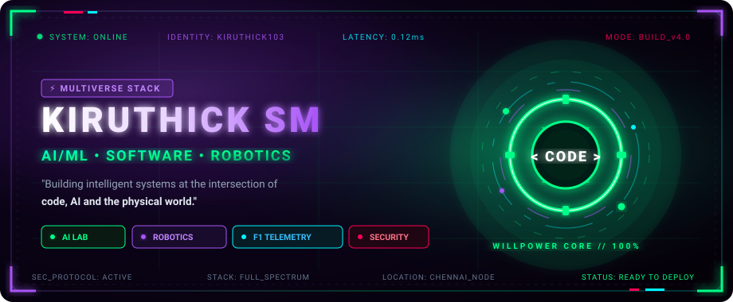
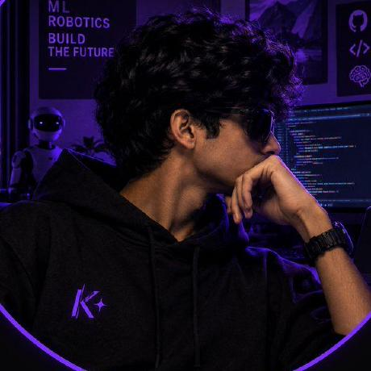
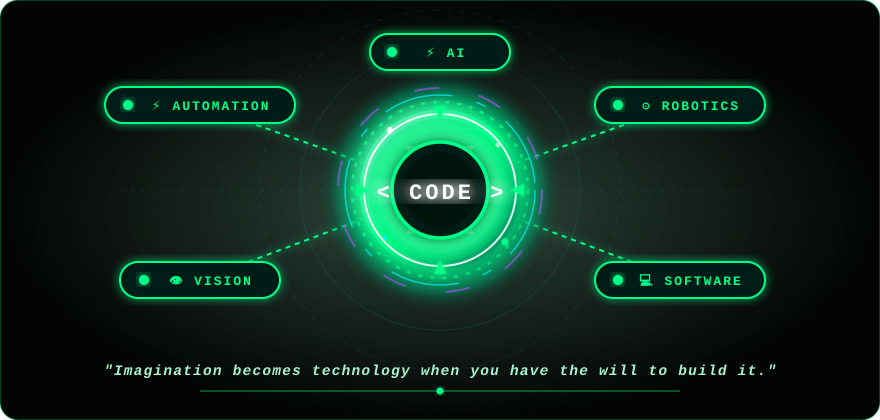
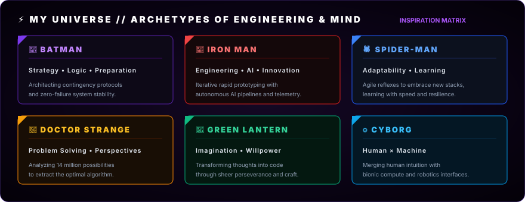
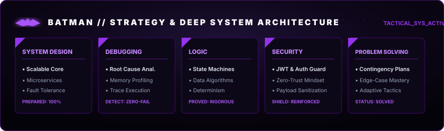
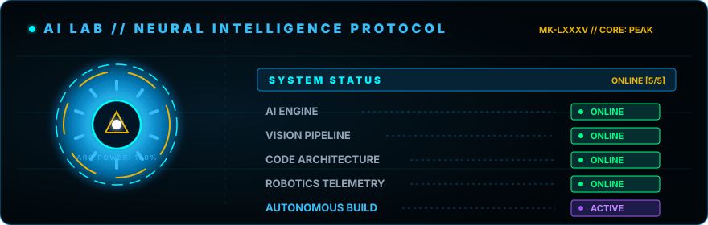
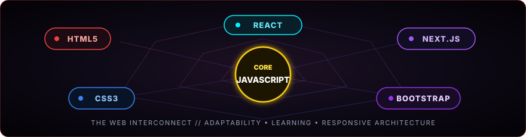
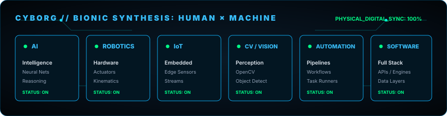
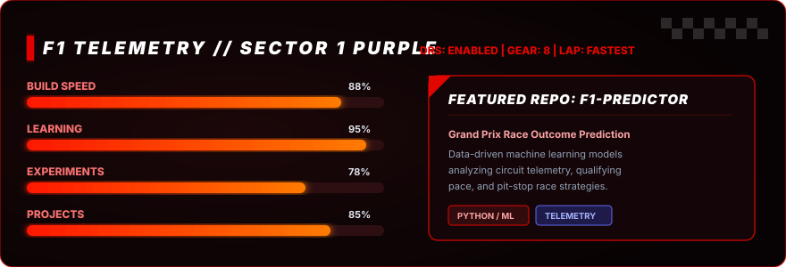
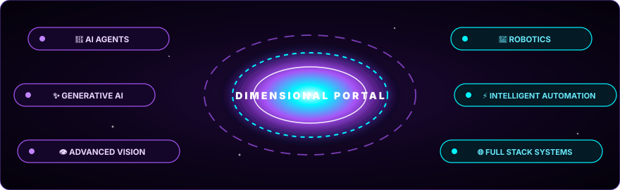

<div align="center">

<!-- HERO BANNER -->


<br/><br/>

<!-- DEVELOPER AVATAR WITH NEON EMERALD & VIOLET FRAME -->
<a href="https://github.com/kiruthick103">
  
</a>

# KIRUTHICK SM
### ⚡ AI/ML • SOFTWARE • ROBOTICS ⚡

> *"Building intelligent systems at the intersection of code, AI and the physical world."*

<br/>

<!-- QUICK HUD BADGES -->
[](https://github.com/kiruthick103)
[](https://github.com/kiruthick103/portfolio-personal)
[](https://www.linkedin.com/in/kiruthick103)
[](https://github.com/kiruthick103)

</div>

<br/>

---

<br/>

<!-- ========================================== -->
<!-- 1. GREEN LANTERN CORE: THE WILL TO BUILD   -->
<!-- ========================================== -->

<div align="center">

# 💚 THE WILL TO BUILD



<br/>

> *"Imagination becomes technology when you have the will to build it."*

<br/>

| ⚡ DOMAIN | 🎯 CORE MISSION | 🛡️ RUNTIME FOCUS |
| :--- | :--- | :--- |
| **🤖 AI** | Autonomous inference & predictive machine learning | Neural heuristics & real-time classification |
| **⚙ ROBOTICS** | Hardware actuation & kinematics synthesis | Microcontrollers, servos, sensory feedback |
| **💻 SOFTWARE** | Scalable distributed web engines & architectures | High-throughput APIs, clean decoupled design |
| **👁 VISION** | Perception pipelines & spatial feature extraction | OpenCV edge detection, real-time object tracking |
| **⚡ AUTOMATION** | Systematic workflows & autonomous build pipelines | Deterministic pipelines, CI/CD orchestration |

</div>

<br/>

---

<br/>

<!-- ========================================== -->
<!-- 2. SUPERHERO UNIVERSE                      -->
<!-- ========================================== -->

## ⚡ MY UNIVERSE

<div align="center">
  
</div>

<br/>

*Symbolic engineering mindsets drawn from timeless archetypes:*

- **🦇 BATMAN** — *Strategy • Logic • Preparation*  
  Architecting fail-safe backends, anticipating edge cases, and building resilient systems before bugs can strike.
- **🦾 IRON MAN** — *Engineering • AI • Innovation*  
  Merging bleeding-edge AI models with rapid iterative development and high-octane engineering.
- **🕷️ SPIDER-MAN** — *Adaptability • Learning*  
  Pivoting seamlessly across evolving frameworks, absorbing paradigms, and swinging through complex codebases.
- **🔮 DOCTOR STRANGE** — *Problem Solving • Different Perspectives*  
  Viewing algorithmic challenges through multidimensional angles to identify the cleanest, most optimal path.
- **💚 GREEN LANTERN** — *Imagination • Willpower*  
  Channeling raw willpower and creative vision into tangible, shipping technological reality.
- **⚙ CYBORG** — *Human × Machine*  
  Bridging biological human intuition with mechanical precision, IoT telemetry, and robotics.

<br/>

---

<br/>

<!-- ========================================== -->
<!-- 3. BATMAN / DARK SYSTEM                     -->
<!-- ========================================== -->

## 🦇 THE DARK SIDE OF THE STACK

<div align="center">
  
</div>

<br/>

```ini
[TACTICAL_SYSTEM_AUDIT]
LEVEL_1 = SYSTEM DESIGN    :: Scalable topologies, microservices, zero single-points-of-failure
LEVEL_2 = DEBUGGING        :: Root-cause diagnostics, heap profiling, memory leak elimination
LEVEL_3 = LOGIC            :: Deterministic state machines, pure mathematical proof flows
LEVEL_4 = SECURITY         :: Zero-trust defenses, JWT tokens, parameter sanitization, RBAC
LEVEL_5 = PROBLEM SOLVING  :: Tactical contingency planning, edge-case mitigation
```

<br/>

---

<br/>

<!-- ========================================== -->
<!-- 4. IRON MAN / AI LAB                       -->
<!-- ========================================== -->

## 🤖 AI LAB

<div align="center">
  
</div>

<br/>

```text
============================================================
              ARC INTELLIGENCE TELEMETRY
============================================================
SYSTEM STATUS
━━━━━━━━━━━━━━━━━━━━━━━━━━━━━━━━━━━━━━━━━━━━━━━━━━━━━━━━━━━━
AI ENGINE           ONLINE      [Neural inference nodes ready]
VISION PIPELINE     ONLINE      [OpenCV contour filters armed]
CODE ARCHITECTURE   ONLINE      [Type-safe systems operational]
ROBOTICS TELEMETRY  ONLINE      [Actuator controller synced]
AUTONOMOUS BUILD    ACTIVE      [Continuous integration engaged]
━━━━━━━━━━━━━━━━━━━━━━━━━━━━━━━━━━━━━━━━━━━━━━━━━━━━━━━━━━━━
DIAGNOSTIC VERDICT: ALL SYSTEMS GO. READY FOR EXPERIMENTAL RUN.
```

<br/>

---

<br/>

<!-- ========================================== -->
<!-- 5. SPIDER-MAN / THE WEB                    -->
<!-- ========================================== -->

## 🕸 THE WEB

<div align="center">
  
</div>

<br/>

<div align="center">

```
   [ HTML5 ] ────────── [ CSS3 ] ────────── [ JAVASCRIPT ]
       │                    │                     │
       ▼                    ▼                     ▼
   [ REACT ] ────────── [ NEXT.JS ] ─────── [ BOOTSTRAP ]
```

*Crafting silky-smooth web interactions, dynamic reactive state, responsive mobile layouts, and modern user-centric interfaces.*

</div>

<br/>

---

<br/>

<!-- ========================================== -->
<!-- 6. CYBORG / HUMAN × MACHINE               -->
<!-- ========================================== -->

## ⚙ HUMAN × MACHINE

<div align="center">
  
</div>

<br/>

```yaml
CYBORG_SYSTEM_SYNTHESIS:
  AI: "Model training, transfer learning, deterministic heuristic wrappers"
  ROBOTICS: "Microcontroller logic, sensor telemetry, servo kinematics"
  IOT: "Connected edge nodes, serial communication, telemetry stream logging"
  COMPUTER_VISION: "Frame processing, contour detection, automated visual inspection"
  AUTOMATION: "Pipeline scripts, automated workflows, headless task runners"
  SOFTWARE: "Full-stack web applications, REST APIs, cloud databases"
```

<br/>

---

<br/>

<!-- ========================================== -->
<!-- 7. F1 SECTION                              -->
<!-- ========================================== -->

## 🏎 THE RACE

<div align="center">
  
</div>

<br/>

```
ENGINEERING TELEMETRY METERS:
━━━━━━━━━━━━━━━━━━━━━━━━━━━━━━━━━━━━━━━━━━━━━━━━━━━━━━━━━━━━
BUILD SPEED       ████████████████░░   88%  [High-velocity sprint]
LEARNING          ██████████████████░  95%  [Rapid absorption]
EXPERIMENTS       ███████████████░░░   78%  [Hypothesis-driven]
PROJECTS          ████████████████░░   85%  [Shipped solutions]
━━━━━━━━━━━━━━━━━━━━━━━━━━━━━━━━━━━━━━━━━━━━━━━━━━━━━━━━━━━━
CURRENT SECTOR: PURPLE  |  DELTA: -0.420s  |  TARGET: P1
```

### 🏁 Featured Repository: [F1-PREDICTOR](https://github.com/kiruthick103/F1-PREDICTOR)
Data-driven machine learning models and analytics analyzing Grand Prix telemetry, qualifying timing data, tire degradation, and circuit dynamics to forecast race outcomes.

<br/>

---

<br/>

<!-- ========================================== -->
<!-- 8. TECH ARSENAL                            -->
<!-- ========================================== -->

## 🛠 TECH ARSENAL

<div align="center">

### 💻 LANGUAGES
[](https://python.org)
[](https://java.com)
[](https://developer.mozilla.org/en-US/docs/Web/JavaScript)
[](https://en.wikipedia.org/wiki/C_(programming_language))
[](https://en.wikipedia.org/wiki/SQL)

### 🎨 FRONTEND
[](https://html.spec.whatwg.org)
[](https://www.w3.org/Style/CSS/)
[](https://react.dev)
[](https://nextjs.org)
[](https://getbootstrap.com)

### ⚙️ BACKEND & APIS
[](https://flask.palletsprojects.com)
[](https://nodejs.org)
[](https://expressjs.com)
[](https://fastapi.tiangolo.com)

### 🗄️ DATABASES
[](https://mysql.com)
[](https://sqlite.org)
[](https://supabase.com)
[](https://mongodb.com)

### 🤖 AI / MACHINE LEARNING & COMPUTER VISION
[](https://opencv.org)
[](https://scikit-learn.org)
[](https://huggingface.co)
[](https://pytorch.org)

### 🧰 TOOLS & PLATFORMS
[](https://git-scm.com)
[](https://github.com)
[](https://code.visualstudio.com)
[](https://docker.com)
[](https://vercel.com)

</div>

<br/>

---

<br/>

<!-- ========================================== -->
<!-- 9. PROJECT MULTIVERSE                      -->
<!-- ========================================== -->

## 🌌 PROJECT MULTIVERSE

<div align="center">
  <p><em>Selected real-world production systems and experimental codebases:</em></p>
</div>

| 🚀 PROJECT | 📝 DESCRIPTION | 🛠️ TECH STACK | 🔗 VIEW PROJECT |
| :--- | :--- | :--- | :--- |
| **ai-orchastrator** | Full-stack AI orchestration platform connecting Hugging Face inference models, streaming LLMs, and local PostgreSQL containerization. | React • Express • PostgreSQL • Docker • Vite | [**Inspect Repository ↗**](https://github.com/kiruthick103/ai-orchastrator) |
| **F1-PREDICTOR** | Formula 1 Grand Prix race prediction engine leveraging telemetry analytics, lap timing models, and pit strategy forecasting. | Python • Machine Learning • Data Analytics | [**Inspect Repository ↗**](https://github.com/kiruthick103/F1-PREDICTOR) |
| **jeff-tune** | Production AI chatbot SaaS with intelligent model routing, real-time token streaming via Vercel AI SDK, and agent tool execution. | Next.js 16 • Hugging Face Router • Supabase • shadcn/ui | [**Inspect Repository ↗**](https://github.com/kiruthick103/jeff-tune) |
| **student-mern** | Full-scale Student Management System with role-based JWT access control, attendance tracking, and Socket.io real-time notifications. | MongoDB • Express • React • Node.js • Socket.io | [**Inspect Repository ↗**](https://github.com/kiruthick103/student-mern) |
| **spidey-tracker** | Spider-Man themed nutrition & health analytics PWA featuring browser camera integration for AI food image recognition and BMR calculations. | HTML5 • CSS3 • JavaScript • Node.js • PWA | [**Inspect Repository ↗**](https://github.com/kiruthick103/spidey-tracker) |
| **riskradar** | Industrial HSSE intelligence engine with hybrid deterministic SIF precursor risk scoring, IOGP rule alignment, and 9-stage Bowtie DAG chains. | React 18 • TypeScript • Python FastAPI • Tailwind CSS | [**Inspect Repository ↗**](https://github.com/kiruthick103/riskradar) |
| **portfolio-personal** | Personal developer portfolio website showcasing engineering identity, interactive UI design, and responsive project layouts. | HTML5 • Modern CSS3 • Vanilla JavaScript | [**Inspect Repository ↗**](https://github.com/kiruthick103/portfolio-personal) |
| **annai-website** | Modern web platform engineered with Next.js App Router and optimized typography. | Next.js • React • Geist Font • CSS | [**Inspect Repository ↗**](https://github.com/kiruthick103/annai-website) |

<br/>

---

<br/>

<!-- ========================================== -->
<!-- 10. SUPERPOWERS                            -->
<!-- ========================================== -->

## ⚡ MY SUPERPOWERS

<div align="center">

| POWER | ATTRIBUTE | FOCUS & APPLICATION |
| :---: | :--- | :--- |
| 🧠 | **Problem Solving** | Deconstructing complex engineering bottlenecks into deterministic components |
| 💻 | **Coding** | Writing clean, modular, maintainable, and idiomatic full-stack code |
| 🤖 | **AI & Machine Learning** | Integrating LLMs, vision pipelines, and intelligent predictive algorithms |
| ⚙ | **Automation** | Eliminating repetitive friction with scripts, bots, and automated tasks |
| 🎨 | **Interface Building** | Designing dark-mode, high-aesthetic, responsive, and intuitive web experiences |
| 🔬 | **Experimentation** | Testing hypotheses, trying novel architectures, and measuring benchmarks |
| 🚀 | **Rapid Learning** | Rapidly grasping and shipping with new tools, libraries, and frameworks |
| 🛠 | **Prototyping** | Taking raw concepts from zero to working, interactive MVPs at lightning speed |

</div>

<br/>

---

<br/>

<!-- ========================================== -->
<!-- 11. NEXT UNIVERSE                          -->
<!-- ========================================== -->

# 🌌 NEXT UNIVERSE

<div align="center">
  

  <br/><br/>

  `[ CURRENT_HORIZON // WHAT I AM DIVING DEEP INTO NEXT ]`

  **🤖 Autonomous AI Agents** • **✨ Generative AI Pipelines** • **👁 Advanced Computer Vision**  
  **🦾 Embodied Robotics** • **⚡ Intelligent Industrial Automation** • **🌐 High-Resilience Full-Stack Systems**

</div>

<br/>

---

<br/>

<!-- ========================================== -->
<!-- 12. SECRET TERMINAL                        -->
<!-- ========================================== -->

<div align="center">

### 📟 SECRET TERMINAL

</div>

```console
$ whoami
kiruthick103

$ mission
build → learn → experiment → improve

$ current_mode
BUILDING...

$ future
LOADING...
```

<br/>

---

<br/>

<!-- ========================================== -->
<!-- 13. GITHUB TELEMETRY                       -->
<!-- ========================================== -->

## 📊 GITHUB TELEMETRY

<div align="center">


<br/><br/>


</div>

<br/>

---

<br/>

<!-- ========================================== -->
<!-- 14. FINAL SECTION                          -->
<!-- ========================================== -->

<div align="center">

# THE STORY IS STILL BEING WRITTEN.
### *"One commit at a time."*

<br/>

[](https://github.com/kiruthick103/portfolio-personal)
[](https://www.linkedin.com/in/kiruthick103)
[](https://github.com/kiruthick103)

<br/><br/>

<sub>*"Built with curiosity, caffeine and way too many ideas."*</sub>

<br/>


</div>
